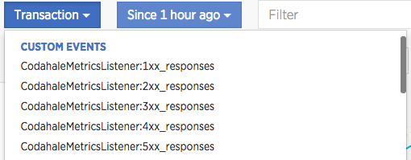
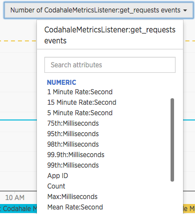

# New Relic Insights Dropwizard Metrics Collector

[  ](https://bintray.com/nike/maven/metrics-new-relic-insights/_latestVersion)
[![][travis img]][travis]
[![][license img]][license]

This library provides a reporter for [Metrics](http://metrics.dropwizard.io/)
that writes to [New Relic Insights](https://newrelic.com/insights).

Each of the main types of Metrics (Gauges, Counters, Histograms, Meters,
Timers) have all available data (percentiles, min, max, etc. as applicable)
reported as "custom metrics" in New Relic.

You can build the project with the following command:

    ./gradlew clean build

Reference the Jar like this in your gradle build file:

    dependencies {
        compile(
            "com.nike.metrics:metrics-new-relic-insights:1.8"
        )
    }

## Usage

Set up your `MetricRegistry` like this:
```
NewRelicReporter reporter = NewRelicReporter.forRegistry(registry)
                .name("New Relic Metrics")
                .filter(MetricFilter.ALL)
                .rateUnit(TimeUnit.SECONDS)
                .durationUnit(TimeUnit.MILLISECONDS)
                .metricNamePrefix("")
                .build();

reporter.start(1, TimeUnit.MINUTES);
```

This will report all attributes of all metrics to New Relic using seconds
as the rate unit and milliseconds as the duration unit. Data will be
reported via the [New Relic Agent](https://docs.newrelic.com/docs/insights/new-relic-insights/adding-querying-data/inserting-custom-events-new-relic-apm-agents) once a minute.

## Custom metrics in New Relic Insights

The metrics reporter will be recognized by Insights as Custom Metrics
and will look something like this in your data explorer:



Things like timers and Gauges have multiple attributes.  In Insights these
will be represented as attributes to the metric which you can see in your
data explorer like this:



Insights has some metric naming restrictions, you should
[read about them here](https://docs.newrelic.com/docs/insights/new-relic-insights/adding-querying-data/inserting-custom-events-new-relic-apm-agents#limits).

[travis]:https://travis-ci.org/Nike-Inc/metrics-new-relic-insights
[travis img]:https://api.travis-ci.org/Nike-Inc/metrics-new-relic-insights.svg?branch=master

[license]:LICENSE.md
[license img]:https://img.shields.io/badge/License-Apache%202-blue.svg